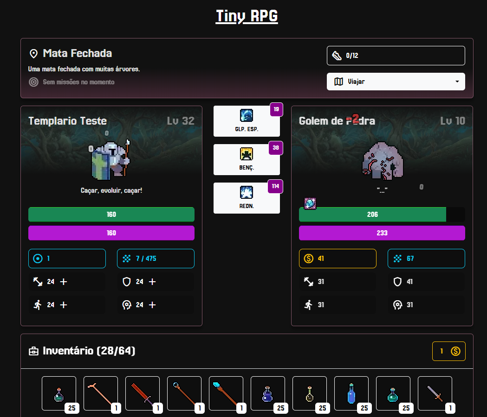

# Tiny RPG



Gerencie sua jornada até os fins dos tempos passando por diferentes regiões em batalhas em tempo real contra diferentes inimigos!

Conquiste o placar de líderes da temporada para garantir recompensas exclusivas!

*Este é um projeto que pretende reviver um jogo que criei na faculdade, junto com a comunidade do [jp_amis](https://www.twitch.tv/jp_amis).*

### Recursos Gráficos

Os gráficos desse jogo não foram feitos por mim, segue abaixo os créditos e links de cada `asset` utilizado:
- [32rogues](https://sethbb.itch.io/32rogues): Sprites do jogador, mãe, inimigos e itens.
- [750 Effect and FX Pixel All](https://bdragon1727.itch.io/750-effect-and-fx-pixel-all): Sprites das partículas de dano. (*Rever licença*)
- [[Verboten Arcane Stash] Basic Skills and Buffs](https://pixerelia.itch.io/vas-basic-spells-and-buffs): Ícones das habilidades e estados. (*Rever Licença*)


## Contribuindo
O jogo está em desenvolvimento e qualquer colaboração (desde que de acordo com o projeto) é bem-vinda! Você pode ver o que está em prioridade no momento conferindo as `Issues` do repositório.

*Todas as colaborações passam por revisão e só serão adicionadas a versão final caso estejam alinhadas com o conceito do jogo*

### Instalação & Execução
```bash
docker-compose up --build
```

### Ideias para o futuro
- Jogador com sprite base masculina ou feminina e equipamentos mudam visual do jogador: https://gandalfhardcore.itch.io/2d-pixel-art-male-and-female-character


### Ideia de progressão

- Existem 3 tipos de equipamento: `ARMA`, `ARMADURA` e `ACESSORIO`
- Existem 3 classes (com suas evoluções): `SELVAGEM`, `MAGO` e `GUERREIRO`

- Deve existir um conjunto (uma `ARMA`, uma `ARMADURA` e um `ACESSORIO`) "extraordinário" para cada classe:
    - `SELVAGEM`: Força e Resistência (`FR`)
    - `MAGO`: Inteligência e Agilidade (`IA`)
    - `GUERREIRO`: Resistência e Inteligência (`RI`)

- Cada peça do conjunto deve estar em uma região diferente.

- Jogador pode renascer
    - Desde que:
        - Tenha level 60
        - Tenha coletado 1 alma de cada chefe
        - Tenha vencido Nulo
    - Ao renascer:
        - Jogador volta para o level 1 (com 2 em cada atributo)
        - Mantem inventário
        - Duplica sua chance de loot (acumulativo)

